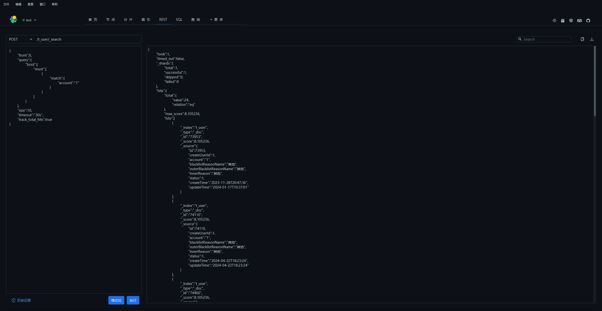
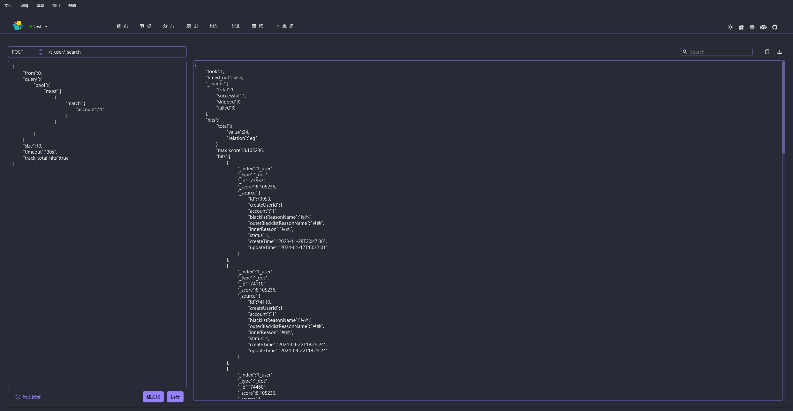
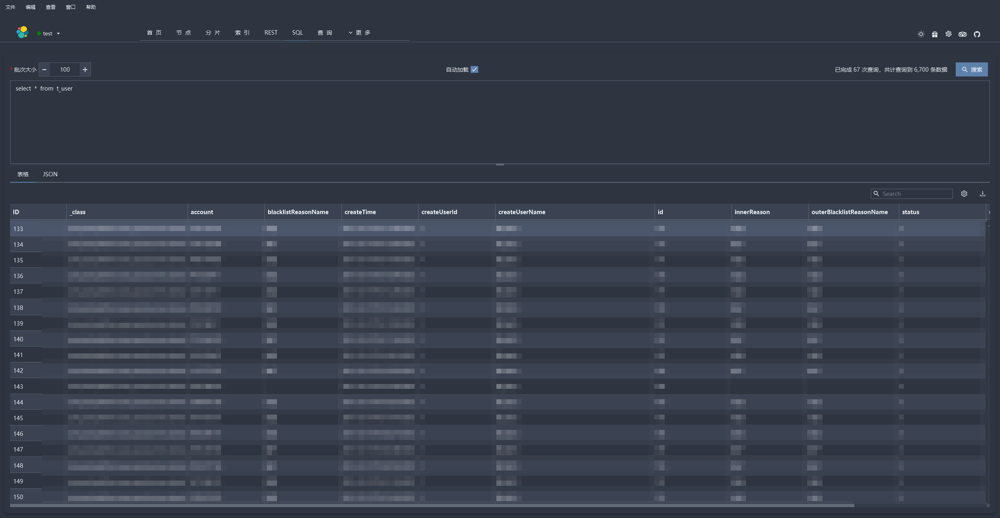

  

> 🚀🚀🚀 Faster, better performing, more stable ES desktop (GUI) management client, compatible with Windows, Mac, Linux, outstanding performance, easy to load large amounts of data

   

[**简体中文**](https://gitee.com/lxwise/elastic-desktop-manager/blob/master/README.md)

[**English**](https://github.com/lxwise/elastic-desktop-manager/blob/master/README.en.md)

## :wrench:elastic-desktop-manager

`elastic-desktop-manager` is a cross-platform `Elasticsearch` query and management tool developed based on JavaFX, with a built-in high-level `Java` high-level client (`High Level REST Client`), aiming to provide a one-stop graphical `Elasticsearch` operation experience for developers, operation and maintenance personnel, data analysts and other users.

🚀The tool supports a rich set of `Elasticsearch` query capabilities, including:

🖥  **Graphical query builder**: No need to write `JSON` or `DSL`, build complex query conditions (Boolean conditions, ranges, fuzzy, nested, etc.) in a visual way, lowering the threshold for use.

🔍 **Aggregation query support**: Built-in aggregation query module supports multi-dimensional and multi-level aggregation, which facilitates data grouping and statistical analysis.

:hammer:**REST API request support**: Provides direct `REST` request execution function, which can facilitate debugging of any `API` interface, replacing tools such as `Postman` and `curl`. 

:triangular_flag_on_post:**Elasticsearch SQL query support**: Supports `SQL` query syntax, making it easier for non-technical personnel to quickly understand and operate ES data.  

📊  **Index, status and performance monitoring**: Real-time view of cluster health status, node information, shard allocation, index list, document quantity, storage usage and other indicators to assist daily operation and maintenance.

💾 **Export and formatting function**: Query results support beautified display and export in `CSV` and `JSON`, which facilitates result storage and reuse.

💦  **Strong version compatibility**: Adapt to `Elasticsearch 7.x` and `8.x` series, with excellent compatibility.

🔁 **Automatic update detection**: Automatically check for new versions at each startup (configurable)

## 🔗Project address

**Gitee address：** [https://gitee.com/lxwise/elastic-desktop-manager](https://gitee.com/lxwise/elastic-desktop-manager)

**Github address：** [https://github.com/lxwise/elastic-desktop-manager](https://github.com/lxwise/elastic-desktop-manager)

## :star::star::star:Star

Although I know that most people like to get something for free like the author, they all leave after reading and downloading the source code. But I still want to ask all the friends who like this project: **Star**, **Star**, **Star**. Only with your **Star** can more people see this project, and more like-minded friends will join in improving this project. Please move your cute little hands and give this project a **Star**. **Also welcome everyone to submit PR and improve the project together**.

## :dash::dash::dash:Download and install

You can download the `exe`, `msi`, `zip`, `rpm`, `deb`, `pkg`, `dmg` installation packages from [github](https://github.com/lxwise/elastic-desktop-manager/releases) or [gitee](https://gitee.com/lxwise/elastic-desktop-manager/releases).

### 🛠 Download

**Github:** https://github.com/lxwise/elastic-desktop-manager/releases

### 👇Alternative downloads

**BaiduNetdisk:** https://pan.baidu.com/s/1c3KZEfwUJ3fPb08cPJ0Jmg?pwd=bvj8

### 🛠 Installation

### ✅ Windows

Download `elastic-desktop-manager.exe`, `elastic-desktop-manager.msi` or `compressed package` version

Double-click to install or run after unzipping

### 🍎 macOS 

Download `elastic-desktop-manager-1.0.1.dmg`, or start it through the `jar` package:

### 🐧 Linux

Download `elastic-desktop-manager-1.0.1-1.x86_64.rpm`, or start it through the `jar` package:

### 💦Other

Download `elastic-desktop-manager.jar` and run `java -jar elastic-desktop-manager.jar`

## :airplane::airplane::airplane:Take off!

| Function         | Light Color                                                  | Dark                                                         | Dracula                                                      | NordDark                                                     |
| ---------------- | ------------------------------------------------------------ | ------------------------------------------------------------ | ------------------------------------------------------------ | ------------------------------------------------------------ |
| Start            |                       | -                                                            | -                                                            | -                                                            |
| Home             |                      |                      |                      |                      |
| Node             |                                    |                      |                      |                      |
| Sharding         |                                    |                      |                      |                      |
| index            |                                    |                      |                      |                      |
| Rest             |                                    |                                    |                                    |                                    |
| Sql              |                                      |                                      |                                      |                                      |
| Query            |                                    |                      |                      |                      |
| Query conditions |  |  |  |  |
| Query Update     |  |  |  |  |
| Connect          |                      |                      |                      |                      |
| set up           |                      |                      |                      |                      |

## :gift:Sponsor

- You can give me a Star on [github](https://github.com/lxwise/elastic-desktop-manager) or [gitee](https://gitee.com/lxwise/elastic-desktop-manager) ⭐⭐ ⭐

- WeChat/Alipay sponsorship code [If you find it useful, please give the author some White Rabbit 🐇🐇🐇 milk candy:star2::star2::star2:]

    

    

      
      
    

    

## 🏆Milestone

- 2025-07-05: The project is officially open source
- 2025-05-17: Provide running log display query
- 2025-04-22: Optimize interaction logic and provide internal version
- 2025-04-13: Startup page, page data cache
- 2025-04-06: Internationalization, automatic update support
- 2025-03-29: Extract common components, es operation extract asynchronous tasks
- 2025-03-18: Table paging support, field copy, field search
- 2025-03-09: Gift, about me, theme switching
- 2025-02-27: Graphical query, update, delete
- 2025-02-16: Graphical query builder and related layouts
- 2025-01-26: Sql query, batch query, result export
- 2025-01-06: REST page, REST command history
- 2025-12-15: Index information, text viewing and search components
- 2024-12-06: Node information
- 2024-11-29: Sharding information
- 2024-11-19: Cluster health information, scheduled task components
- 2024-11-05: System settings and themes
- 2024-10-29: Global menu and routing
- 2024-10-23: Home page layout
- 2024-10-17: Submit the first code
- 2024-10-13: Project incubation

##  :triangular_ruler:Dev Build

> Tips: This is a development environment, used to run the complete project. **Ordinary users** can directly download the installation package from the previous page

|     Tool     |         Illustrate         |
| :----------: | :------------------------: |
|     IDEA     | Java Development Tools IDE |
| SceneBuilder |  JavaFx Development Tools  |

| Development Environment | Version |
| :---------------------: | :-----: |
|         OpenJDK         | 21.0.2  |
|         JavaFx          | 23.0.1  |
|      SceneBuilder       | 22.0.0  |
|      elasticsearch      | 7.10.0  |
|         kibana          | 7.10.0  |

## 📌 Precautions

Before running, make sure that `Elasticsearch` is started and can be connected in the target environment.

This project is a pure client tool and will not upload data or collect any user privacy information.

## 🙌 Grateful

**Thanks to all open source contributors**, thanks to the big guys in the group for answering questions, javafx communication group: **`518914410`**, thanks to all developers who use, give feedback and contribute. If you have suggestions or bug feedback during use, you are welcome to submit an issue or participate in the contribution.

