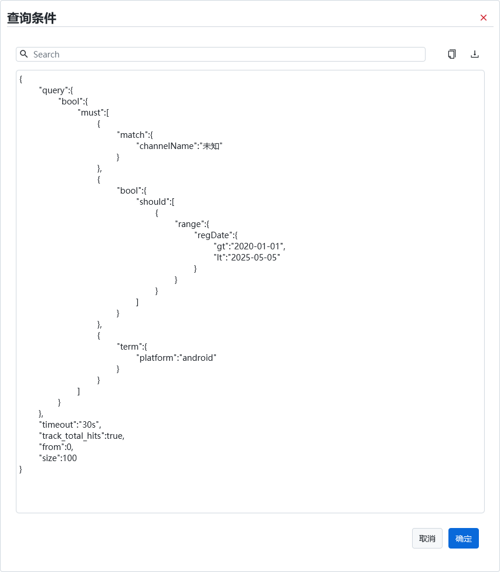

  

> 🚀🚀🚀 更快、性能更好、更稳定的ES桌面(GUI)管理客户端，兼容Windows、Mac、Linux，性能出众，轻松加载大量数据

   

[**简体中文**](https://gitee.com/lxwise/elastic-desktop-manager/blob/master/README.md)

[**English**](https://github.com/lxwise/elastic-desktop-manager/blob/master/README.en.md)

## :wrench:elastic-desktop-manager

`elastic-desktop-manager` 是一款基于 JavaFX 开发的跨平台 `Elasticsearch `查询与管理工具，内置高阶 `Java `高阶客户端（`High Level REST Client`），旨在为开发者、运维人员、数据分析师等用户提供一站式的图形化 `Elasticsearch` 操作体验。

🚀该工具支持丰富的 `Elasticsearch` 查询功能，包括：

🖥  **图形化查询构建器**：无需编写 `JSON` 或` DSL`，通过可视化方式构建复杂查询条件（布尔条件、范围、模糊、嵌套等），降低使用门槛。

🔍 **聚合查询支持**：内置聚合查询模块，支持多维度、多级别聚合，便于数据分组、统计分析。

:hammer:  **REST API 请求支持**：提供直接的 `REST` 请求执行功能，可方便调试任意 `API` 接口，替代` Postman`、`curl` 等工具。

:triangular_flag_on_post:  **Elasticsearch SQL 查询支持**：支持 `SQL` 查询语法，便于非技术人员快速理解和操作 ES 数据。

📊  **索引、状态与性能监控**：实时查看集群健康状态、节点信息、分片分配、索引列表、文档数量、存储使用等指标，辅助日常运维。

💾  **导出与格式化功能**：查询结果支持`CSV `、`JSON `美化展示与导出，便于结果保存与复用。

💦  **版本兼容性强**：适配 `Elasticsearch 7.x` 与 `8.x` 系列，兼容性优秀。

🔁  **自动更新检测**：每次启动自动检查新版本（可配置）

## 🔗项目地址

**Gitee 地址：** [https://gitee.com/lxwise/elastic-desktop-manager](https://gitee.com/lxwise/elastic-desktop-manager)

**Github 地址：** [https://github.com/lxwise/elastic-desktop-manager](https://github.com/lxwise/elastic-desktop-manager)

## :star::star::star:Star

ps: 虽然我知道，大部分人和作者菌一样喜欢白嫖，都是看了直接下载源代码后就潇洒的离开。但我还是想请各位喜欢本项目的小伙伴：**Star**，**Star**，**Star**。只有你们的**Star**本项目才能有更多的人看到，才有更多志同道合的小伙伴一起加入完善本项目。请小伙伴们动动您可爱的小手，给本项目一个**Star**。**同时也欢迎大家提交pr，一起改进项目** 。

## :dash::dash::dash:下载安装

可以在[github](https://github.com/lxwise/elastic-desktop-manager/releases) 或者 [gitee](https://gitee.com/lxwise/elastic-desktop-manager/releases)下载`exe`、`msi`、`zip`、` rpm`、 `deb`、 `pkg`、`dmg` 安装包

### 🛠 下载地址

**Github:** https://github.com/lxwise/elastic-desktop-manager/releases

### 👇备用下载

**百度云:** https://pan.baidu.com/s/1c3KZEfwUJ3fPb08cPJ0Jmg?pwd=bvj8

### 🛠 安装方式

### ✅ Windows

下载 `elastic-desktop-manager.exe`、`elastic-desktop-manager.msi`或`压缩包`版本

双击安装或解压后运行

### 🍎 macOS 

下载 `elastic-desktop-manager-1.0.1.dmg`，或通过 `jar` 包启动：

### 🐧 Linux

下载 `elastic-desktop-manager-1.0.1-1.x86_64.rpm`，或通过 `jar `包启动：

### 💦其他

下载 `elastic-desktop-manager.jar` 运行`java -jar elastic-desktop-manager.jar`

## :airplane::airplane::airplane:起飞!

| 功能   | 浅色                         | 深色                        | Dracula                   | NordDark                  |
|------|----------------------------|---------------------------|---------------------------|---------------------------|
| 启动   |        | -                         | -                         | -                         |
| 主页   |       |      |      |      |
| 节点   |      |      |      |      |
| 分片   |      |      |      |      |
| 索引   |      |      |      |      |
| Rest |  |  |  |  |
| Sql  |    |    |    |    |
| 查询   |      |      |      |      |
| 查询条件 |   |  |  |  |
| 查询更新 |   |  |  |  |
| 连接   |       |      |      |      |
| 设置   |       |      |      |      |

## :gift:赞助

- 可以在[github](https://github.com/lxwise/elastic-desktop-manager) 或者 [gitee](https://gitee.com/lxwise/elastic-desktop-manager)给我点个Star⭐⭐ ⭐ 

- 微信/支付宝赞助码 [觉得好用，请作者菌恰几颗大白兔🐇🐇🐇奶糖:star2::star2::star2:]

  
  
  

    
    
  

  
  

## 🏆里程碑

- 2025-07-05: 项目正式开源
- 2025-05-17: 提供运行日志显示查询
- 2025-04-22: 优化交互逻辑、提供内侧版本
- 2025-04-13: 启动页面、页面数据缓存
- 2025-04-06: 国际化、自动更新支持
- 2025-03-29: 抽取公共组件、es操作提取异步任务
- 2025-03-18: 表格分页支持、字段复制、字段搜索
- 2025-03-09: 礼物、关于我、主题切换
- 2025-02-27: 图形化查询、更新、删除
- 2025-02-16: 图形化查询构建器和相关布局
- 2025-01-26: Sql查询、分批查询、结果导出
- 2025-01-06: REST页面、REST命令历史记录
- 2025-12-15: 索引信息、文本查看和搜索组件
- 2024-12-06: 节点信息
- 2024-11-29: 分片信息
- 2024-11-19: 集群健康信息、定时任务组件
- 2024-11-05: 系统设置和主题
- 2024-10-29: 全局菜单和路由
- 2024-10-23: 首页布局
- 2024-10-17: 提交第一份代码
- 2024-10-13: 项目孵化

##  :triangular_ruler:Dev Build

> Tips: 此为开发环境，用于运行完整项目，**普通用户**直接从前面下载安装包即可

|     工具     |       说明        |
| :----------: | :---------------: |
|     IDEA     | Java 开发工具 IDE |
| SceneBuilder |  JavaFx开发工具   |

|   开发环境    |  版本  |
| :-----------: | :----: |
|    OpenJDK    | 21.0.2 |
|    JavaFx     | 23.0.1 |
| SceneBuilder  | 22.0.0 |
| elasticsearch | 7.10.0 |
|    kibana     | 7.10.0 |

## 📌 注意事项

运行前请确保目标环境中 `Elasticsearch` 已启动并可连接。

本项目为纯客户端工具，不会将数据上传或收集任何用户隐私信息。

## 🙌 感谢

**感谢所有开源贡献者们**，感谢群里大佬们的答疑解惑，javafx交流群: **`518914410`** ，感谢感谢所有使用、反馈与贡献的开发者。如果你在使用中有建议、Bug 反馈，欢迎提交 Issue 或参与贡献。

